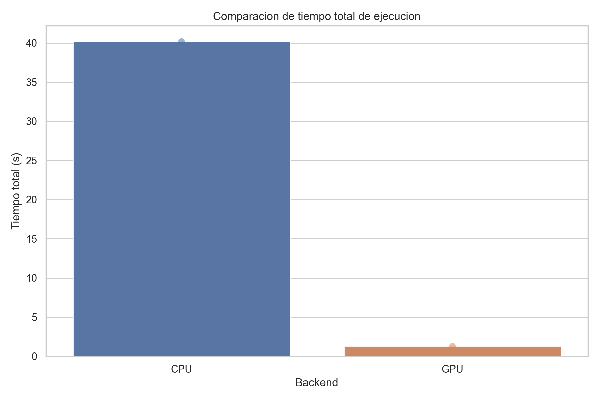
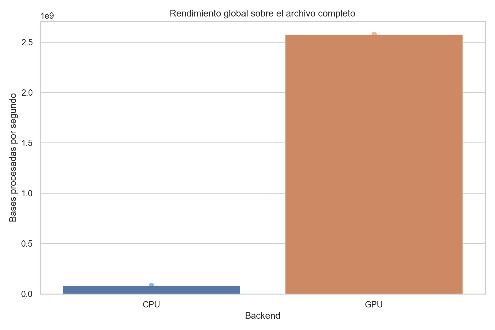
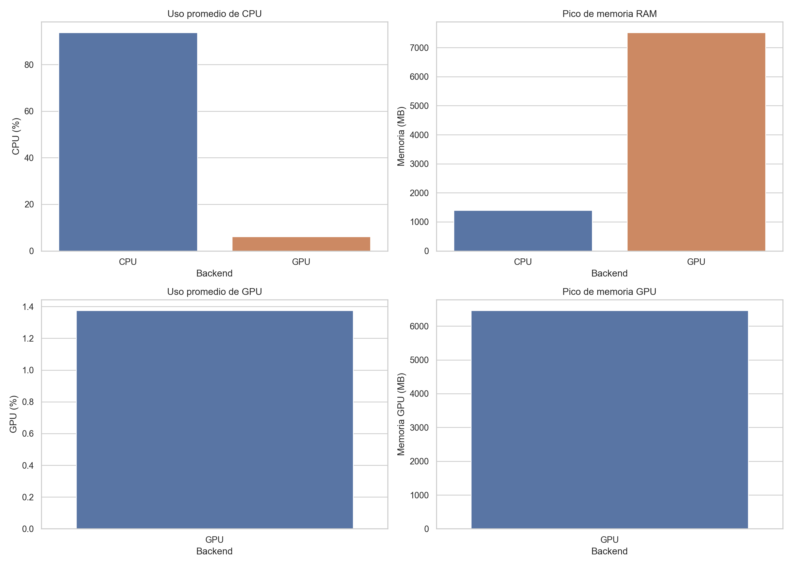

# computacion_paralela

## colaborativo2


# Conteo Paralelo: CPU vs GPU

Este proyecto implementa el **conteo de bases nucleotídicas (A, C, G, T)** en archivos para el genoma humano, comparando el rendimiento entre dos estrategias de paralelización: procesamiento en **CPU con múltiples procesos** (usando `ProcessPoolExecutor` de Python) y procesamiento masivo en **GPU** (usando CUDA a través de CuPy). El objetivo es evaluar de forma cuantitativa cuál backend ofrece mayor rendimiento para este tipo de carga de trabajo sobre archivos genómicos de gran tamaño.

`colaborativo2.py` tiene dos modos:

1. Ejecucion normal: corre CPU y GPU y muestra los conteos.
2. Benchmark: compara CPU vs GPU sobre el archivo completo y genera CSV, resumen y graficas.

### Uso normal

```bash
.venv/bin/python colaborativo2/colaborativo2.py \
  --file colaborativo2/GCF_000001405.40_GRCh38.p14_genomic.fna \
  --converter-path colaborativo2/c/build/c \
  --processors 8
```

### Uso benchmark

```bash
.venv/bin/python colaborativo2/colaborativo2.py \
  --file colaborativo2/GCF_000001405.40_GRCh38.p14_genomic.fna \
  --converter-path colaborativo2/c/build/c \
  --processors 8 \
  --benchmark \
  --benchmark-repeats 1 \
  --benchmark-output-dir colaborativo2/benchmark_artifacts
```

### Parametros del benchmark

- `--file`: archivo FASTA completo a analizar.
- `--converter-path`: ejecutable en C usado por la ruta GPU para transformar el FASTA.
- `--processors`: numero de procesos para CPU.
- `--benchmark`: activa el modo de comparacion y generacion de artefactos.
- `--benchmark-repeats`: cantidad de repeticiones por backend.
- `--benchmark-output-dir`: directorio donde se guardan resultados y graficas.

### Que genera

Dentro del directorio indicado en `--benchmark-output-dir` se generan:

- `benchmark_results.csv`
- `summary.md`
- `plots/comparacion_tiempos.png`
- `plots/uso_recursos.png`
- `plots/errores_por_segundo.png`
- `plots/rendimiento_global.png`

### Como se miden los tiempos

- CPU: solo se mide el tiempo de ejecucion del `ProcessPoolExecutor`.
- GPU: solo se mide el conteo sobre la matriz ya cargada en GPU.
- La llamada al convertidor en C no entra en el tiempo de GPU del benchmark.


- El benchmark usa el archivo completo, no subsets.
- Si ejecutas sin `--benchmark`, no se generan graficas.

---

## Características

- Procesamiento paralelo en CPU con `ProcessPoolExecutor`, distribuyendo el archivo en chunks por proceso.
- Procesamiento en GPU mediante kernels CUDA ejecutados con CuPy, con conversión previa del archivo FASTA a binario usando un programa en C++.
- Modo de benchmarking que ejecuta ambos backends sobre el archivo completo y genera artefactos comparativos.
- Monitoreo de recursos en tiempo real (CPU %, memoria RAM, GPU %, memoria GPU) durante cada ejecución.
- Generación automática de gráficas y un resumen en Markdown con los resultados.

---

## Estructura del proyecto

```
colaborativo2/
├── colaborativo2.py          # Punto de entrada principal
├── cpu_integration.py        # Lógica de procesamiento paralelo en CPU
├── gpu_integration.py        # Lógica de procesamiento en GPU con CuPy
├── benchmark_runner.py       # Orquestador de benchmarks y generación de gráficas
├── benchmark_models.py       # Modelos de datos para resultados de benchmark
├── resource_monitor.py       # Monitor de recursos del sistema (CPU, RAM, GPU)
├── analysis_output.py        # Serialización y escritura de resultados a JSON
├── dto.py                    # Data Transfer Objects (DnaAnalysis, ExecutionType)
├── c/
│   └── main.cpp              # Convertidor FASTA → binario (usado por la ruta GPU)
└── requirements.txt
```

---

## Instalación

```bash
pip install -r requirements.txt
```

Dependencias principales:

```
numpy
pandas
seaborn
matplotlib
psutil
cupy-cuda12x
```

> **Nota:** `cupy-cuda12x` requiere una GPU NVIDIA con CUDA 12 instalado. Si no se dispone de GPU, el benchmark puede ejecutarse solo con `--skip-gpu`.

También es necesario compilar el programa en C++ antes de usar la ruta GPU:

```bash
cd c/
mkdir build && cd build
cmake .. && cmake --build .
```

---

## Uso

### Ejecución normal (CPU + GPU)

```bash
python colaborativo2.py \
  --file GCF_000001405.40_GRCh38.p14_genomic.fna \
  --converter-path c/build/c \
  --processors 8
```

### Modo benchmark (comparación CPU vs GPU)

```bash
python colaborativo2.py \
  --file GCF_000001405.40_GRCh38.p14_genomic.fna \
  --converter-path c/build/c \
  --processors 8 \
  --benchmark \
  --benchmark-repeats 3 \
  --benchmark-output-dir benchmark_artifacts
```

### Parámetros disponibles

| Parámetro | Descripción |
|---|---|
| `--file` | Archivo FASTA a analizar |
| `--converter-path` | Ejecutable en C++ para convertir FASTA a binario |
| `--processors` | Número de procesos paralelos para la ruta CPU |
| `--benchmark` | Activa el modo de comparación CPU vs GPU |
| `--benchmark-repeats` | Repeticiones por backend |
| `--benchmark-output-dir` | Directorio de salida para CSV, resumen y gráficas |
| `--skip-cpu` | Omite la ejecución del backend CPU |
| `--skip-gpu` | Omite la ejecución del backend GPU |

---

## Artefactos generados

Dentro del directorio indicado en `--benchmark-output-dir`:

- `benchmark_results.csv` — Resultados crudos de cada ejecución
- `summary.md` — Resumen estadístico por backend
- `plots/comparacion_tiempos.png` — Tiempo total de ejecución por backend
- `plots/uso_recursos.png` — Uso de CPU, RAM y GPU
- `plots/errores_por_segundo.png` — Velocidad de identificación de bases inválidas
- `plots/rendimiento_global.png` — Throughput en bases procesadas por segundo

---

## Cómo funciona

### Backend CPU

1. Se calcula el tamaño del archivo y se divide en `N` chunks según el número de procesos indicado.
2. Cada proceso abre el archivo de forma independiente, salta al offset correspondiente y lee línea a línea, contando las bases válidas (A, C, G, T) e inválidas.
3. Los resultados parciales se consolidan con un `Counter` de Python.
4. **Solo se mide el tiempo del `ProcessPoolExecutor`**, excluyendo la inicialización de procesos previos.

### Backend GPU

La ruta GPU está dividida en dos etapas separadas por diseño:

#### Etapa 1 — Conversión en C++ (fuera del tiempo medido)

El archivo es procesado por un programa en C++ (`main.cpp`) que:
- Lee el archivo línea a línea, ignorando cabeceras (`>`).
- Almacena el valor ASCII crudo de cada carácter de secuencia como `uint8_t` en un archivo binario (`dna_matrix.bin`).
- Escribe un archivo de metadatos (`dna_matrix.meta`) con las dimensiones del arreglo resultante.

Esta conversión se hace **fuera del tiempo medido del benchmark** deliberadamente, ya que representa un paso de preprocesamiento del dato, no el cómputo analítico en sí.

#### Por qué se usa C++ para la conversión

Python tiene un overhead significativo al leer y transformar archivos de texto de varios GB de forma secuencial. El programa en C++ realiza esta tarea de forma eficiente en términos de I/O y sin dependencias adicionales, produciendo un binario compacto y listo para ser cargado directamente en la GPU. Esto permite que la medición de rendimiento de la GPU se centre exclusivamente en el trabajo de cómputo paralelo masivo.

#### Etapa 2 — Cómputo en GPU con CuPy (tiempo medido)

1. El binario se carga en CPU como un arreglo `numpy.ndarray` de tipo `uint8`.
2. Se transfiere a la GPU con `cp.asarray()`.
3. Se sincronizan los streams CUDA antes de iniciar el cronómetro.
4. Se ejecutan operaciones vectorizadas sobre la GPU (`cp.sum`) para contar cada base por su valor ASCII.
5. Se sincronizan los streams nuevamente antes de detener el cronómetro.

Este diseño garantiza que **solo se mide el tiempo de cómputo puro en GPU**, sin incluir la transferencia de datos ni la conversión del archivo.

---

## Benchmarking

El módulo `benchmark_runner.py` orquesta la ejecución de ambos backends y recopila métricas de rendimiento. Para cada ejecución:

- Se instancia un `ResourceMonitor` que muestrea CPU, RAM y (si aplica) GPU cada 200 ms en un hilo separado.
- Se ejecuta el backend correspondiente y se registra el análisis.
- Al finalizar, el monitor se detiene y produce un `ResourceUsage` con promedios y picos.

Las métricas clave calculadas son:

- **`bases_per_second`**: throughput global (bases del archivo / tiempo de ejecución).
- **`invalids_per_second`**: velocidad de identificación de caracteres no válidos.
- **`avg_cpu_percent` / `peak_cpu_percent`**: uso de CPU durante la ejecución.
- **`peak_memory_mb`**: pico de memoria RAM del proceso y sus hijos.
- **`avg_gpu_util_percent` / `peak_gpu_memory_mb`**: métricas de GPU vía `nvidia-smi`.

Los resultados se exportan a un CSV y se visualizan automáticamente con Seaborn y Matplotlib, siendo en nuestro caso unicamente Matplotlib.

### Cómo se miden los tiempos (resumen)

| Backend | Qué se mide | Qué se excluye |
|---|---|---|
| CPU | Tiempo del `ProcessPoolExecutor` | Inicialización de procesos |
| GPU | Conteo sobre la matriz ya en GPU | Conversión C++ y transferencia a GPU |

---

## Análisis de resultados

El benchmark fue ejecutado sobre el genoma humano completo (GRCh38.p14), procesando **~3.3 mil millones de bases** en una sola ejecución por backend, usando 16 procesos para CPU.

### Tiempo de ejecución



La GPU completó el análisis en **~1.28 segundos**, mientras que la CPU requirió **~40.2 segundos** usando 16 procesos en paralelo. Esto representa una **aceleración de aproximadamente 31×** a favor de la GPU. La diferencia es tan pronunciada que en la gráfica la barra de la GPU es prácticamente imperceptible frente a la de la CPU.

### Rendimiento global (throughput)



La GPU procesó aproximadamente **2.58 mil millones de bases por segundo**, frente a los **82 millones de bases por segundo** de la CPU. Este resultado refleja la capacidad masivamente paralela de la GPU para aplicar la misma operación de comparación sobre millones de elementos simultáneamente, algo para lo que la arquitectura SIMD de CUDA está específicamente diseñada.

### Velocidad de identificación de errores


En cuanto a la detección de bases inválidas, la GPU identificó **~1.06 mil millones de errores por segundo**, contra los **~33 millones por segundo** de la CPU. La proporción es coherente con el throughput general, confirmando que la ventaja de la GPU no es específica del tipo de operación sino estructural.

### Uso de recursos



El análisis de recursos revela las contrapartidas de cada enfoque:

- **CPU**: utilizó en promedio el **93.7% de los 16 núcleos disponibles**, con un pico de 104%, lo que indica una carga efectiva y sostenida del procesador durante toda la ejecución. El uso de RAM fue moderado: **~1.4 GB de pico**.

- **GPU**: el uso del procesador host fue mínimo (~6.2%), ya que la carga computacional recae en la tarjeta gráfica. Sin embargo, la GPU requirió **~7.5 GB de RAM del sistema** para almacenar el arreglo binario antes de transferirlo, y **~6.46 GB de memoria de video** para alojar la matriz en VRAM. El uso de los núcleos CUDA reportado por `nvidia-smi` fue de apenas ~1.4% en promedio, lo que sugiere que la operación es tan rápida que el muestreo cada 200 ms captura el proceso casi terminado.

---

## Conclusión general

La GPU supera ampliamente a la CPU en este tipo de carga de trabajo, logrando una aceleración de **~31×** con un tiempo de cómputo de 1.28 segundos frente a 40.2 segundos. Esto se debe a que el conteo de bases es una operación embarazosamente paralela: la misma comparación se aplica de forma independiente a cada byte del archivo, lo que encaja perfectamente con el modelo de ejecución masivamente paralela de CUDA.

No obstante, la ruta GPU tiene un costo importante en **memoria**: necesita cargar todo el archivo en RAM y luego en VRAM antes de comenzar el cómputo. Para archivos que superen la memoria disponible de la tarjeta gráfica, este enfoque requeriría procesamiento por lotes o una arquitectura diferente.

La CPU, por su parte, procesa el archivo en streaming sin necesidad de cargarlo completo en memoria, lo que la hace más adecuada en entornos con recursos de memoria limitados o cuando no se dispone de hardware GPU. En términos de costo-beneficio, si se prioriza la eficiencia de recursos sobre la velocidad máxima, un rango de 8 a 13 procesos en CPU ofrece un buen equilibrio entre tiempo de procesamiento y consumo de núcleos.


