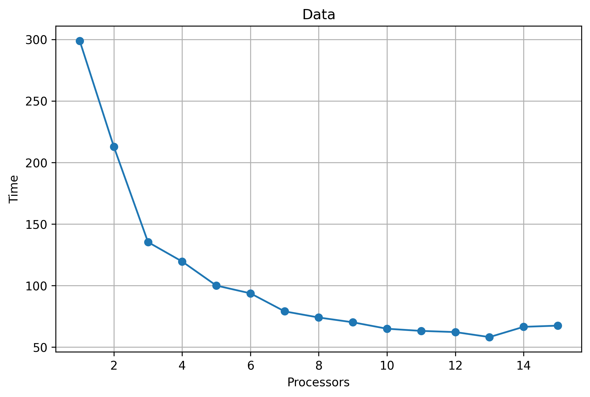
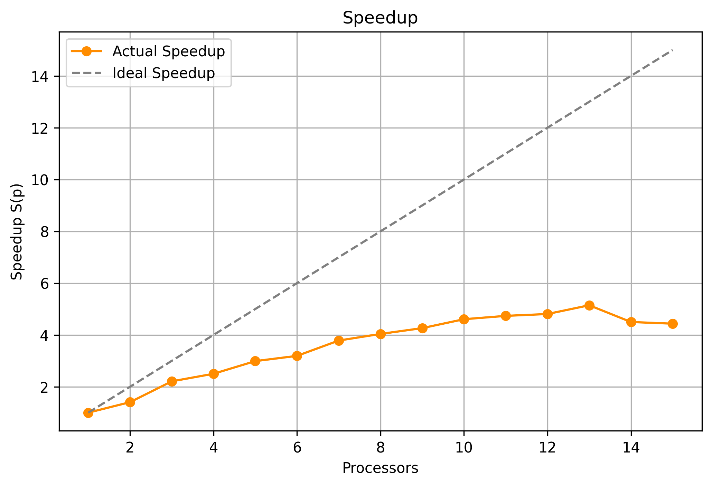
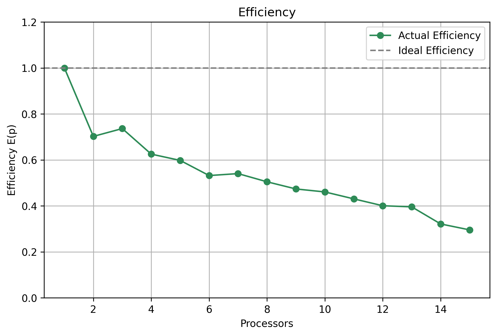

# Conteo Paralelo de Bases en Archivos FASTA

Este proyecto es un script en Python diseñado para **contar las bases nucleotídicas (A, C, G, T)** en archivos de secuencias tipo FASTA, utilizando **procesamiento paralelo** para optimizar el rendimiento en archivos grandes. Además, incluye un modo iterativo para **benchmarking** y generación de gráficos que permiten analizar el desempeño del procesamiento paralelo.

---

## Características

- Procesamiento paralelo utilizando `ProcessPoolExecutor`.
- Compatible con archivos grandes en formato FASTA.
- Opción iterativa para medir tiempos con distintos números de procesadores.
- Generación automática de gráficos de rendimiento:
  - `grafica.png` → Tiempo de ejecución vs. número de procesadores.
  - `grafica_speedup.png` → Speedup real vs. ideal.
  - `grafica_efficiency.png` → Eficiencia real vs. ideal.
- Salida final en formato JSON con el conteo de bases: `conteo_final_{n}p.json`.

---

## Requisitos

- Python 3.7 o superior
- Paquetes Python:

pip install matplotlib numpy

# Uso
## Ejecución simple

Cuenta las bases utilizando un número fijo de procesadores:
python main.py --file ruta/al/archivo.fasta --processors 4

## Modo iterativo (Benchmarking)
Ejecuta el script para todos los procesadores desde 1 hasta el número indicado, generando gráficos de rendimiento:
python main.py --file ruta/al/archivo.fasta --processors 8 --iterative

* Los gráficos se guardan en la carpeta actual (grafica.png, grafica_speedup.png, grafica_efficiency.png).
* El conteo final de bases se guarda en conteo_final_{n}p.json.

## Cómo funciona
1. El archivo se divide en chunks (porciones) según el número de procesadores.
2. Cada chunk es procesado en paralelo contando las bases A, C, G y T.
3. Los resultados parciales se consolidan usando un Counter de Python.
4. Si se ejecuta en modo iterativo, se calcula:
 * Tiempo de ejecución.
 * Speedup y eficiencia real vs. ideal.
5. Se generan gráficos que permiten visualizar el rendimiento del procesamiento paralelo.

## Resultados

El proyecto genera gráficos que permiten evaluar cómo cambia el rendimiento según la cantidad de procesadores utilizados:

Interpretación: Puedes analizar cómo disminuye el tiempo de ejecución al aumentar los procesadores, y cómo se acerca o se aleja del rendimiento ideal. Los gráficos grafica_speedup.png y grafica_efficiency.png proporcionan información adicional sobre speedup y eficiencia, respectivamente.

