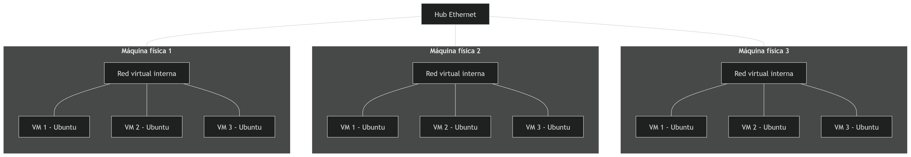

# Colaborativo 2.2 "Clusters de computadores"

## Tecnologías usadas

- Ubuntu como sistema operativo para los servidores
- Munge como sistema de autenticación entre nodos
- Slurm como sistema gestor de recursos y planificador de trabajos para clústeres
- VMWare como software de virtualización de máquinas virtuales

## Estructura
### Roles de los nodos
Se cuentan con 3 máquinas físicas, dentro de cada uno de ellas
se crearán 3 máquinas virtuales con el sistema operativo Ubuntu.
Las máquinas físicas se conectarán físicamente mediante un hub y con cables
Ethernet. De esta forma estarán conectadas físicamente con la menor latencia posible.

De esta forma tendremos un total de 9 nodos. De los 9 nodos, solo 1
actuará como nodo "maestro", mientras el resto seran nodos "esclavos".

## Instrucciones 
Para montar esta estructura, los pasos a seguir esta en el archivo `INSTRUCTIONS.md`

## Recomendaciones
1. Para montar esta estructura, es importante verificar que las máquinas físicas
cuente con los recursos necesarios para albergar las máquinas virtuales. Por ejemplo
en este caso cada máquina virtual necesita 4 GB de RAM, 2 Processors y 10 GB de
disco duro.

2. Para realizar este cluster se recomienda una conexión directa entre máquinas. Se
pueden usar alternativas como VPN, pero esto agregaría demasiada latencia a la
comunicación y el procesamiento, lo que hace inútil todo el esfuerzo de montar
el cluster en primer lugar.

3. Una forma rápida de optimizar el proceso de creación de cluster virtuales
es clonar una máquina ya configurada y solo ajustar ciertos parámetros como el
nombre de la máquina y la configuración del nodo maestro para que la reconozca 
como parte del cluster.

4. Para montar este tipo de arquitecturas, sistemas operativos basados en UNIX
como ubuntu son recomendables debido a que la mayoría de clusters se crean con 
este tipo de sistemas operativos.

5. Para construir una arquitectura de cluster, se recomienda fuertemente tener
conocimientos en distintas áreas como Sistemas Operativos, Redes y Programación
para poder hacerlo bien.