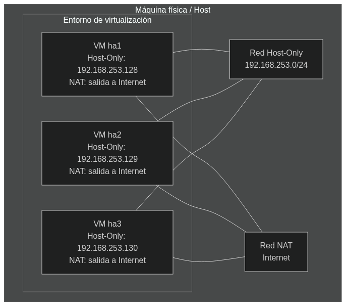
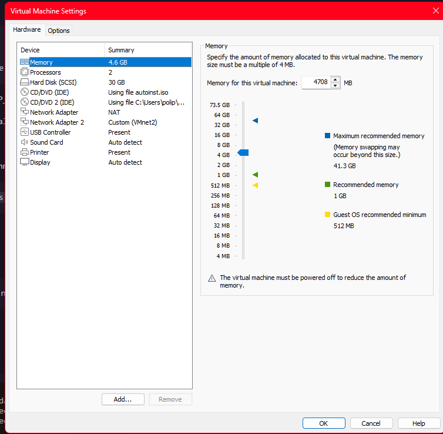
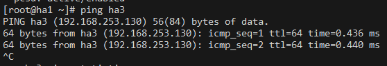
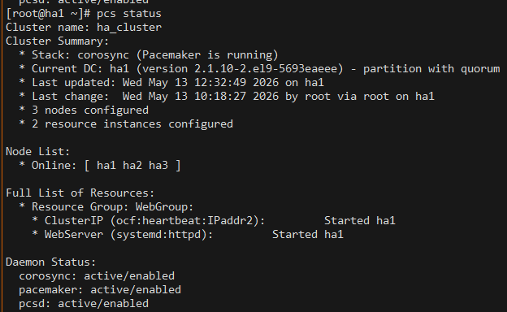
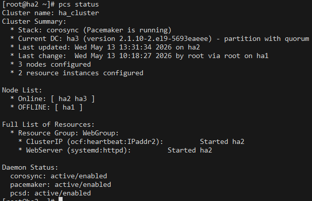

# Colaborativo 2.2
## Integrantes
- Alfonso Chafla
- Omar Lozada
- Sebastian Jacome
- Antonio Proaño

# Arquitectura del cluster

 1. Configurar hostname en cada nodo
El cluster de alta disponibilidad (High Availability) esta compuesto por tres maquinas virtuales, cada una con un sistema operativo CentOS.

Los nodos seran maquinas virtuales que se crearan mediante el software VMWare con esta configuracion:



Cada maquina esta conectada a un NAT y a una red Host-Only por la que se comunicaran entre si.

# Eleccion del sistema operativo
Se eligio el sistema operativo CentOS porque es compatible con el software que necesitamos instalar para poder configurar nuestro cluster.

# Configuracion

###  1. Nodos
Para este cluster tendremos 3 nodos:
- ha1
- ha2
- ha3

Las ip asignadas a cada nodo son:
- ha1: 192.168.253.128
- ha2: 192.168.253.129
- ha3: 192.168.253.130

- VIP: 192.168.253.144 (IP Virtual del cluster)

### 2. Configuracion del hostname

Primero debemos de cambiar el hostname de cada nodo al correspondiente de esta forma.
```bash

sudo hostnamectl set-hostname NOMBRE_NODO
exec bash

```
### 3. Configuracion de red

Ejecutamos ```nmcli con show``` para identificar la interface de red, la cual en nuestro caso es "ens37". Ejecutamos lo siguiente para configurarla con la IP correspondiente a cada nodo:

```bash 
sudo nmcli con mod "ens37" ipv4.addresses IP_DEL_NODO/24

sudo nmcli con mod "ens37" ipv4.method manual

sudo nmcli con mod "ens37" ipv4.gateway ""

sudo nmcli con mod "ens37" ipv4.dns ""sudo nmcli con up "ens37"
```
Adicionalmente necesitamos editar el archivo ```etc/hosts``` en cada nodo para que los nodos puedan comunicarse entre si
```bash
    192.168.253.128 ha1
    192.168.253.129 ha2
    192.168.253.130 ha3
    192.168.253.144 cluster-vip
```
Y podemos comprobar que existe conectividad entre los nodos ejecutando el comando ```ping NOMBRE_NODO```
```bash 
ping ha1
ping ha2
ping ha3
ping cluster-vip
```

### 4. Instalacion del software
Antes de instalar debemos de actualizar el sistema de todos los nodos ejecutando el comando ```sudo dnf update -y```
Esto se hace para todos los nodos.
Instalamos sofware basico.
```bash 
sudo dnf install -y vim nano net-tools bind-utils wget curl bash-completion dnf-plugins-core
```
Posiblemente tengamos que habilitar mas repositorios para poder instalar el software del cluster.
```bash 
sudo dnf repolist all

sudo dnf config-manager --set-enabled highavailability

sudo dnf config-manager --set-enabled HighAvailability

sudo dnf clean all

sudo dnf makecache
```
Luego podemos instalar el software necesario para la creacion del cluster.
```bash 
sudo dnf install -y pacemaker corosync pcs fence-agents-all
```
Verificamos que la instalacion sea correcta
```bash 
rpm -q pacemaker corosync pcs resource-agents fence-agents-all
```
Y finalmente habilitamos los servicios de PCS.
```bash 
sudo systemctl enable --now sshd

sudo systemctl enable --now firewalld

sudo systemctl enable --now pcsd
```
### 5. Configuracion del firewall
Debemos habilitar los puertos necesarios para la comunicacion entre los nodos y las operaciones del cluster.

```bash 
sudo firewall-cmd --permanent --add-service=ssh

sudo firewall-cmd --permanent --add-service=http

sudo firewall-cmd --permanent --add-service=high-availability

sudo firewall-cmd --reload
```
### 6.Configuracion del usuario de cluster

Debemos crear una contraseña para el usuario de cluster. Esto se ejecuta en todos los nodos.

```bash 
sudo passwd hacluster
```

Para este laboratorio en concreto la password es ```thehousealwayswins```

### 7. Configuracion inicial del cluster

Desde ha1 ejecutaremos 
```bash
sudo pcs host auth ha1 ha2 ha3 -u hacluster
```
Luego ejecutaremos 
```bash
sudo pcs cluster setup ha_cluster ha1 ha2 ha3
```
Finalmente lo podemos iniciar:
```bash
sudo pcs cluster start --all
``` 
Ademas habilitamos que el cluster inicie automaticamente con el sistema:
```bash
sudo pcs cluster enable --all
```
Configuramos la politica de quorum.
```bash 
sudo pcs property set no-quorum-policy=ignore
```
Desactivamos STONITH.
```bash 
sudo pcs property set stonith-enabled=false
```
Configuramos la IP virtual.
```bash 

sudo pcs resource create ClusterIP ocf:heartbeat:IPaddr2 ip=192.168.253.144 cidr_netmask=24 op monitor interval=30s```

```
Verificamos 
```bash
pcs status
```

### 8. Servicio Apache
Instalamos Apache
```bash 
sudo dnf install httpd -y
```
Habilitamos el servicio
```bash 
sudo systemctl enable --now httpd
```

En cadaa nodo ejecutamos
```bash 
echo "Servidor activo: NODO" | sudo tee /var/www/html/index.html
```
Luego lo desactivamos para pasarle el servicio al cluster.
```bash 
sudo systemctl stop httpd

sudo systemctl disable httpd
```
Desde ha1 creamos el recurso.
```bash 
sudo pcs resource create WebServer systemd:httpd op monitor interval=30s
```
Agrupamos el recurso de la IP virtual y el recurso de Apache.
```bash 
sudo pcs resource group add WebGroup ClusterIP WebServer
```
Verificamos
```bash
pcs status
```
Si todo ha salido bien tendremos esta salida:



De esta forma ya tenemos el cluster funcional con failover automatico.
Por ejemplo ahora el servicio web corre en ha1.


Pero despues de apagar la maquina ha1, el servicio web se mueve a ha2.


Y el estado queda asi:



Con el nodo ha1 en modo offline, pero con un cambio automatico que cambia el servicio a ese nodo.

# Conclusiones y recomendaciones

- El cluster que se construyo fue un cluster de alta disponiblidad, que se caracteriza por garantizar la disponibilidad de un servicio siempre a pesar de los nodos que fallen. Sin embargo hay que tener en cuenta que este no es un cluster de alto rendimiento, ya que con la configuracion que se tiene no se pueden repartir el trabajo en paralelo. Lo que se tiene simplemente garantiza que un servicio siempre se ejecute y en caso de falla se mude a otro nodo.

- En un entorno de produccion es necesario configurar STONITH para evitar el efecto de "split-brain", que ocurre cuando el cluster se divide en dos mitades que no pueden comunicarse entre si. En ese caso, ambas mitades intentaran tomar el control del servicio, lo que puede causar problemas. Sin embargo en este caso al ser solo una demonstracion no lo habilitaremos.

- La configuracion de un cluster es un proceso que requiere tiempo y dedicacion, pero que puede ser muy gratificante ya que permite tener un servicio siempre disponible y tolerante a fallos. Esto puede ser extremadamente util en entornos productivos donde siempre tenemos que tener un servicio critico en funcionamiento

