# Colaborativo 3.2 — API de Análisis de ADN

Para este colaborativo replicaremos la dinamica del colaborativo 3.1 pero usaremos proveedores cloud asiaticos y europeos.
El dockerfile que desplegaremos sera el mismo que el colaborativo anterior, y la prueba sera la misma.

# Despliegue Scaleaway (Europa)
En este proveedor vamos a usar el servicio de Serverless Containers, el cual nos permite desplegar contenedores docker sin necesidad de gestionar la infraestructura subyacente. Para esto, primero debemos crear una cuenta en Scaleaway y luego seguir los pasos para configurar nuestro entorno.
## Set up
Luego de crear nuestra cuenta con un metodo de pago valido entraremos al menu de Serverless Container y crearemos uno.
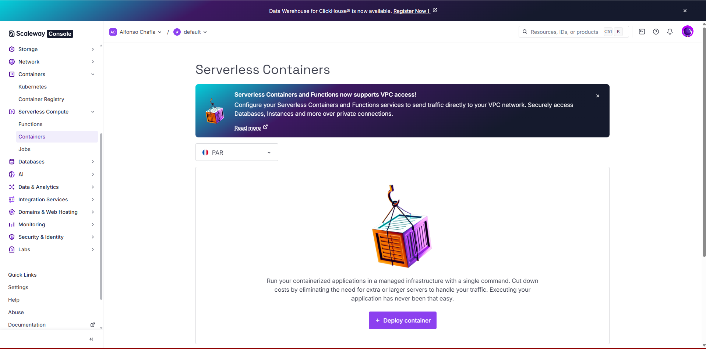
Primero debemos crear un namespace, que es un concepto parecido al de los grupos de recursos de otros proveedores.
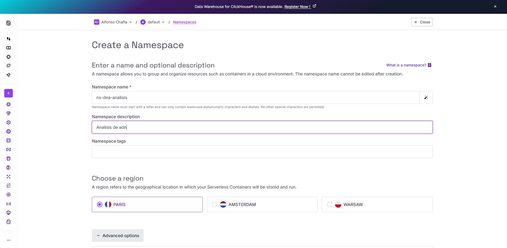
Luego procederemos con la creacion del contenedor, donde usaremos la url de la imagen de docker que usamos en el anterior colaborativo y configuraremos el puerto 8000 como puerto de exposicion.
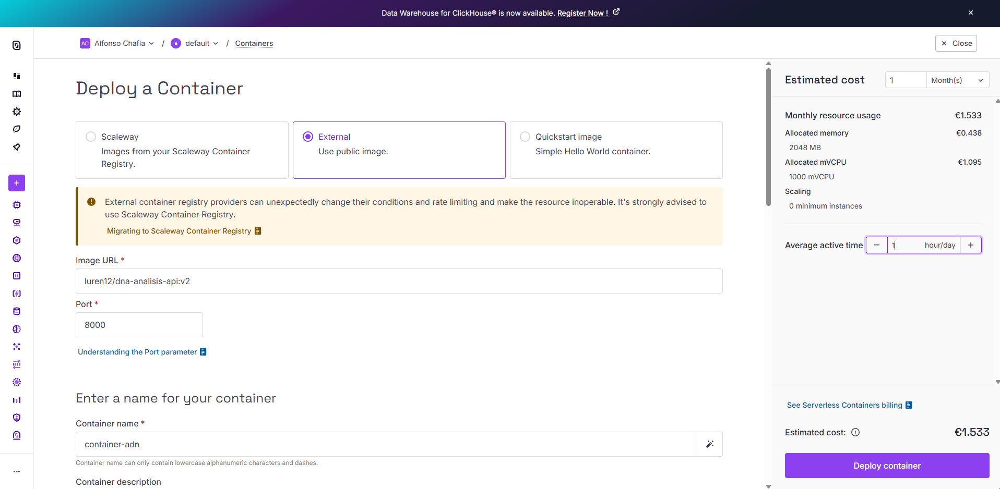
Scaleaway es bastante flexxible con la capacidad que podemos darle a cada contenedor y ademas nos permite combinarlo con escalado en base a request. En este caso configuraremos 500mVCPU y 1024 MB  de RAM. Ademas configuramos que pueda desescalar a 0 cuando no haya trafico , y que llegue hasta 5 replicas cuando se requiera.
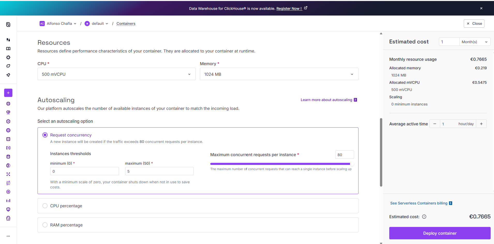
 Con esto nuestro contenedor ya quedo configurado y listo para usar. 
 ## Pruebas
 Podemos ver como accediendo a la url publica podemos acceder a la documentacion swagger.
 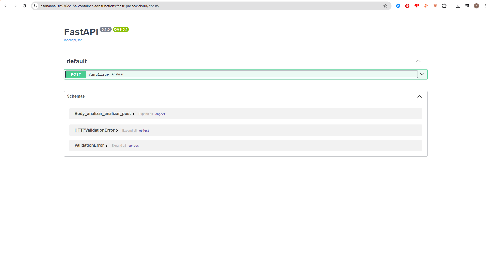
  Intentamos usar el archivo de 1 GB pero no dio resultados por mas de 1 minuto entonces se aborto la trasaccion. El resultado para el archivo de 20 mb fue el siguiente:
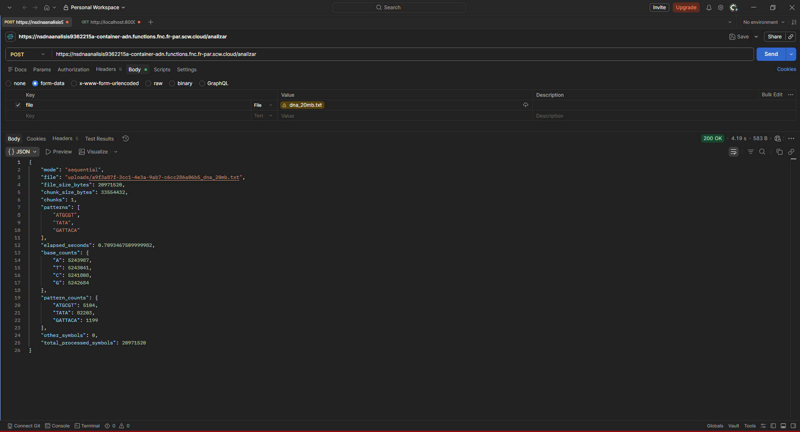
En total tardo 4.19 segundos, lo cual es bastante rapido.

Se intento revisar las metricas de uso , pero Scaleaway usa una integracion con Grafana que no funciono correctmaente, por lo que no se pudieron revisar las metricas de uso del contenedor.
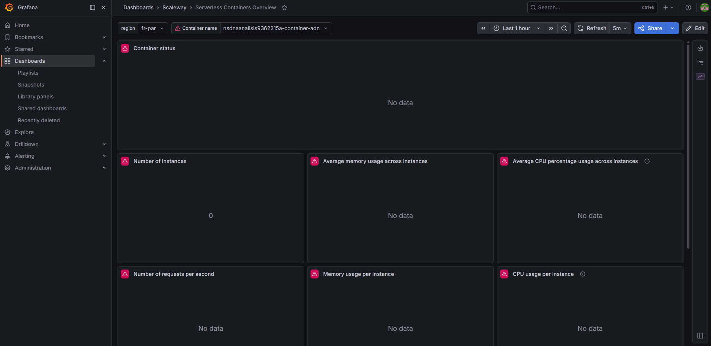
## Conclusionesle Scaleaway
Scaleaway es un proveedor bastante facil de usar con un ainterfaz bastante agradable y costos bastante accesibles. Lo negativo del servicio es que este tiene solo centros de datos en europa y su integracion con Grafana no funciono correctamente, lo que impidio revisar las metricas de uso del contenedor. Todo el proceso de levantar el contenedor fue bastante facil y rapido, y el resultado de la prueba fue bastante bueno, con un tiempo de respuesta de 4.19 segundos para el archivo de 20 mb.

# Despliegue Alibaba Cloud (Asia)
En este proveedor usaremos el servicio de **Elastic Container Instance (ECI)**, que es el equivalente serverless de contenedores en Alibaba Cloud. Este servicio permite ejecutar contenedores sin gestionar la infraestructura subyacente, similar a lo que ofrece Scaleaway con sus Serverless Containers.
## Set up
Al entrar al servicio de Elastic Container Instance podemos ver la lista de Container Groups, que es el concepto central de ECI: un grupo puede contener uno o mas contenedores que comparten recursos y red.

Procedemos a crear un nuevo Container Group. En la configuracion basica seleccionamos el metodo de facturacion **Pay-as-you-go**, la region **China (Hangzhou)**, y usamos la VPC y vSwitch por defecto. El security group por defecto permite trafico ICMP, y agrega automaticamente los puertos que declaremos en la configuracion del contenedor.
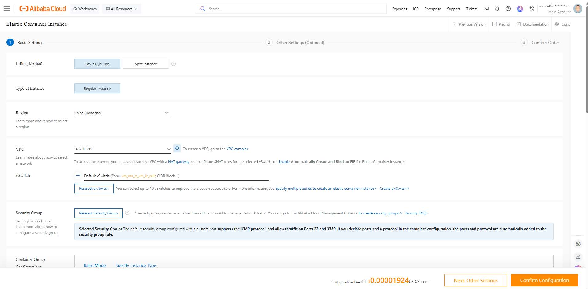
A continuacion configuramos el Container Group. Elegimos la categoria de computo **Economy**, con **1 vCPU** y **2 GiB** de memoria RAM. La politica de reinicio se deja en **Always**, para que el contenedor se reinicie automaticamente si falla.
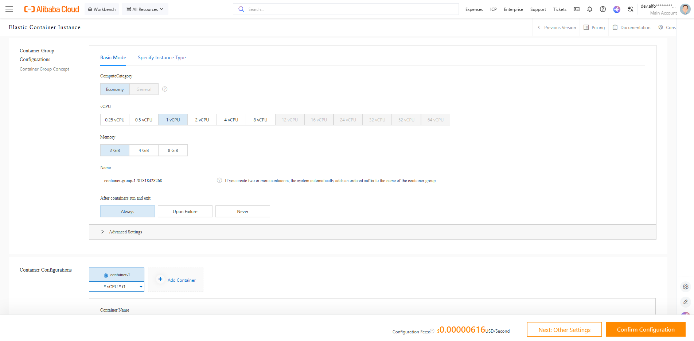
Luego configuramos el contenedor en si. Le damos el nombre **dna-container** y especificamos la imagen `luren12/dna-analisis-api` con el tag `v2`, que es la misma imagen usada en los colaborativos anteriores. La politica de pull se configura como **Always** para asegurar que siempre se use la version mas reciente.
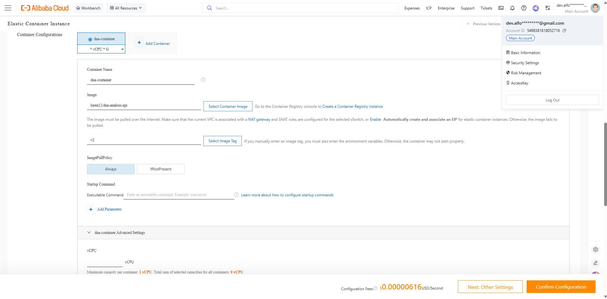
En la configuracion avanzada del contenedor habilitamos **Ports & Protocol** y declaramos el puerto **8000** con protocolo **TCP**, que es el puerto donde corre la API. Alibaba Cloud agrega este puerto automaticamente al security group.
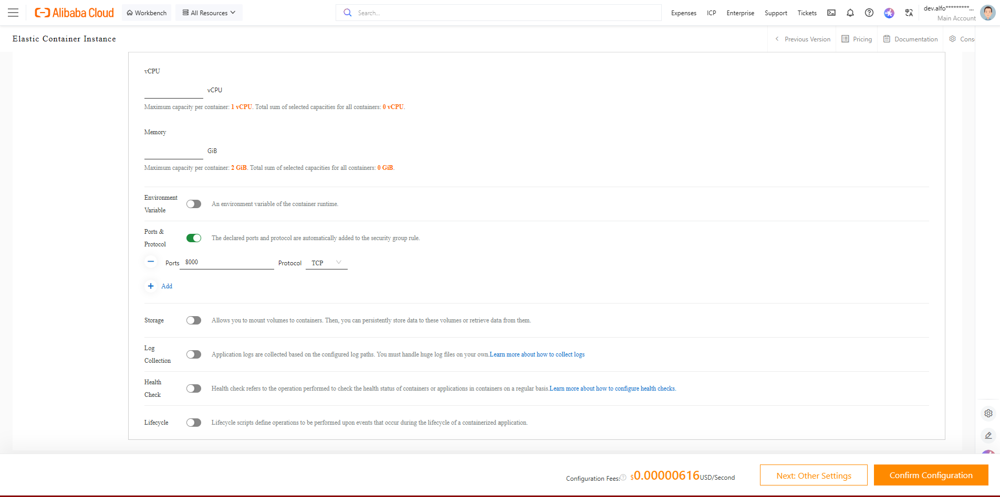
Finalmente, en la pantalla de confirmacion podemos revisar el resumen completo: region China (Hangzhou), Pay-as-you-go, especificacion 1 vCPU 2 GiB, contenedor `dna-container` con imagen `luren12/dna-analisis-apiv2` y puerto 8000 expuesto. El costo configurado es de $0.00000616 USD/segundo.
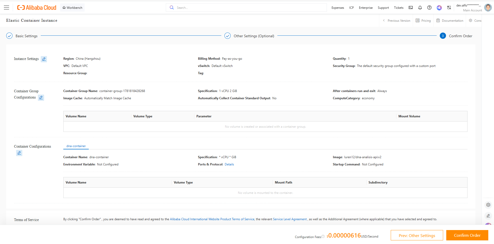
## Pruebas
Realizamos la misma prueba que con Scaleaway, enviando el archivo `dna_20mb.txt` al endpoint `/analizar` mediante Postman. El contenedor respondio correctamente con status **200 OK** en **6.00 segundos**, procesando los 20,971,520 bytes del archivo en un solo chunk. Los resultados son identicos a los demas proveedores, confirmando que el despliegue es correcto.
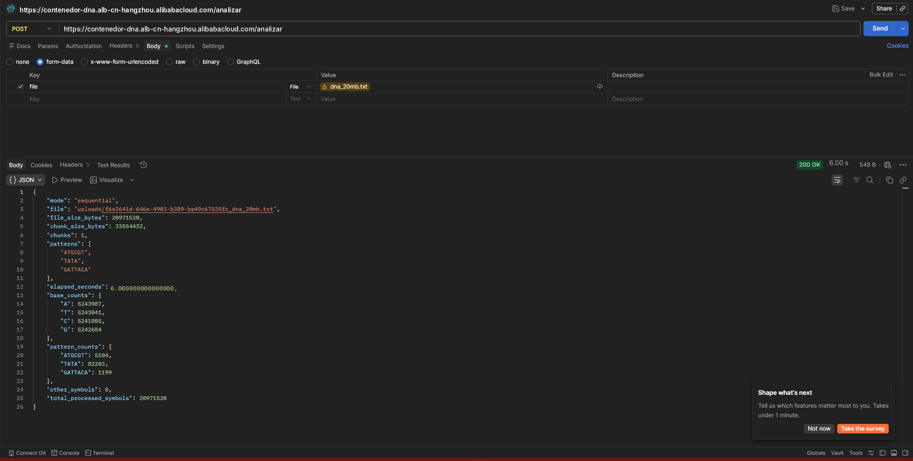
## Conclusiones Alibaba Cloud
Alibaba Cloud ECI es un servicio funcional para desplegar contenedores sin gestionar servidores, con una interfaz detallada que expone bastante granularidad en la configuracion (VPC, vSwitch, security groups, politicas de reinicio). El modelo de precios Pay-as-you-go es muy economico ($0.00000616 USD/segundo ≈ $0.53 USD/dia para 1 vCPU + 2 GiB). Sin embargo, la mayoria de los centros de datos se encuentran en Asia, lo que puede implicar mayor latencia para usuarios en otras regiones. El proceso de configuracion es mas complejo que en Scaleaway, requiriendo conocimiento de conceptos de red como VPC, vSwitch y security groups.
