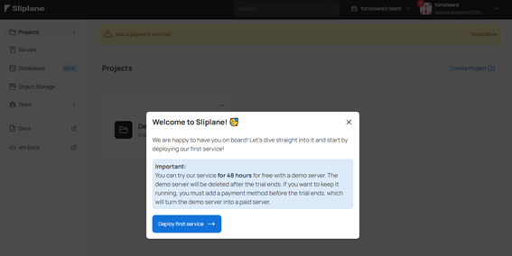
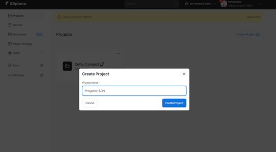
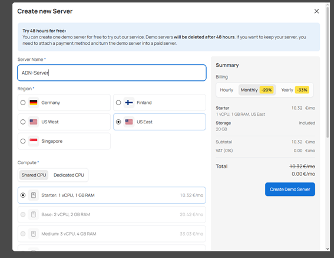
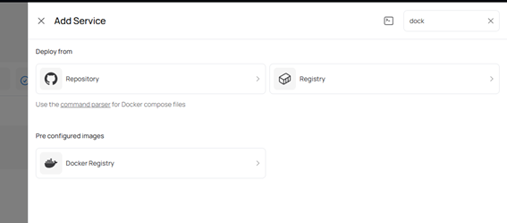
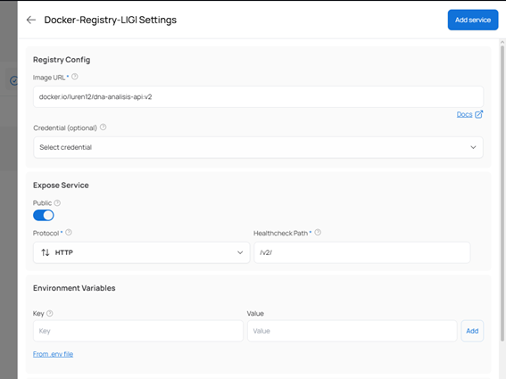
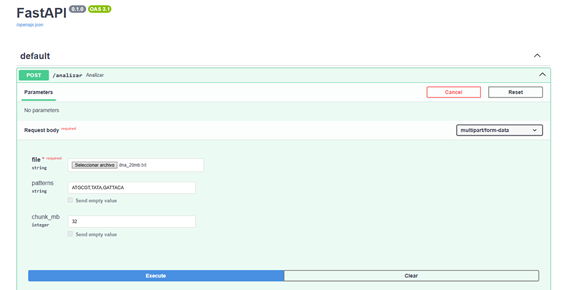
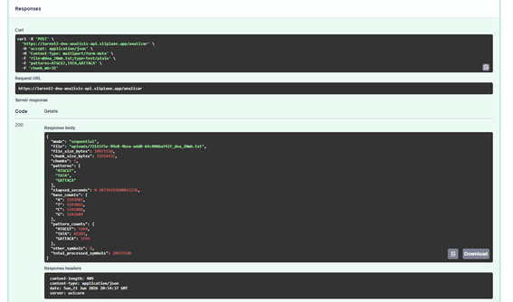
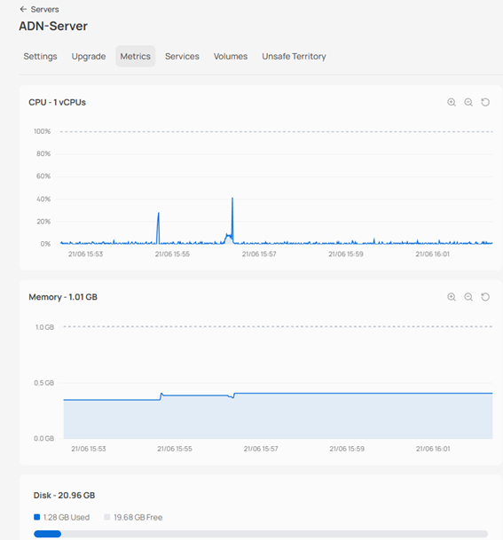

# Colaborativo 3.2 — API de Análisis de ADN

Para este colaborativo replicaremos la dinamica del colaborativo 3.1 pero usaremos proveedores cloud asiaticos y europeos.
El dockerfile que desplegaremos sera el mismo que el colaborativo anterior, y la prueba sera la misma.

# Despliegue Scaleaway (Europa)
En este proveedor vamos a usar el servicio de Serverless Containers, el cual nos permite desplegar contenedores docker sin necesidad de gestionar la infraestructura subyacente. Para esto, primero debemos crear una cuenta en Scaleaway y luego seguir los pasos para configurar nuestro entorno.
## Set up
Luego de crear nuestra cuenta con un metodo de pago valido entraremos al menu de Serverless Container y crearemos uno.

Primero debemos crear un namespace, que es un concepto parecido al de los grupos de recursos de otros proveedores.

Luego procederemos con la creacion del contenedor, donde usaremos la url de la imagen de docker que usamos en el anterior colaborativo y configuraremos el puerto 8000 como puerto de exposicion.

Scaleaway es bastante flexxible con la capacidad que podemos darle a cada contenedor y ademas nos permite combinarlo con escalado en base a request. En este caso configuraremos 500mVCPU y 1024 MB  de RAM. Ademas configuramos que pueda desescalar a 0 cuando no haya trafico , y que llegue hasta 5 replicas cuando se requiera.

 Con esto nuestro contenedor ya quedo configurado y listo para usar. 
 ## Pruebas
 Podemos ver como accediendo a la url publica podemos acceder a la documentacion swagger.
 
  Intentamos usar el archivo de 1 GB pero no dio resultados por mas de 1 minuto entonces se aborto la trasaccion. El resultado para el archivo de 20 mb fue el siguiente:

En total tardo 4.19 segundos, lo cual es bastante rapido.

Se intento revisar las metricas de uso , pero Scaleaway usa una integracion con Grafana que no funciono correctmaente, por lo que no se pudieron revisar las metricas de uso del contenedor.

## Conclusionesle Scaleaway
Scaleaway es un proveedor bastante facil de usar con un ainterfaz bastante agradable y costos bastante accesibles. Lo negativo del servicio es que este tiene solo centros de datos en europa y su integracion con Grafana no funciono correctamente, lo que impidio revisar las metricas de uso del contenedor. Todo el proceso de levantar el contenedor fue bastante facil y rapido, y el resultado de la prueba fue bastante bueno, con un tiempo de respuesta de 4.19 segundos para el archivo de 20 mb.

# Despliegue Alibaba Cloud (Asia)
En este proveedor usaremos el servicio de **Elastic Container Instance (ECI)**, que es el equivalente serverless de contenedores en Alibaba Cloud. Este servicio permite ejecutar contenedores sin gestionar la infraestructura subyacente, similar a lo que ofrece Scaleaway con sus Serverless Containers.
## Set up
Al entrar al servicio de Elastic Container Instance podemos ver la lista de Container Groups, que es el concepto central de ECI: un grupo puede contener uno o mas contenedores que comparten recursos y red.

Procedemos a crear un nuevo Container Group. En la configuracion basica seleccionamos el metodo de facturacion **Pay-as-you-go**, la region **China (Hangzhou)**, y usamos la VPC y vSwitch por defecto. El security group por defecto permite trafico ICMP, y agrega automaticamente los puertos que declaremos en la configuracion del contenedor.

A continuacion configuramos el Container Group. Elegimos la categoria de computo **Economy**, con **1 vCPU** y **2 GiB** de memoria RAM. La politica de reinicio se deja en **Always**, para que el contenedor se reinicie automaticamente si falla.

Luego configuramos el contenedor en si. Le damos el nombre **dna-container** y especificamos la imagen `luren12/dna-analisis-api` con el tag `v2`, que es la misma imagen usada en los colaborativos anteriores. La politica de pull se configura como **Always** para asegurar que siempre se use la version mas reciente.

En la configuracion avanzada del contenedor habilitamos **Ports & Protocol** y declaramos el puerto **8000** con protocolo **TCP**, que es el puerto donde corre la API. Alibaba Cloud agrega este puerto automaticamente al security group.

Finalmente, en la pantalla de confirmacion podemos revisar el resumen completo: region China (Hangzhou), Pay-as-you-go, especificacion 1 vCPU 2 GiB, contenedor `dna-container` con imagen `luren12/dna-analisis-apiv2` y puerto 8000 expuesto. El costo configurado es de $0.00000616 USD/segundo.

## Pruebas
Realizamos la misma prueba que con Scaleaway, enviando el archivo `dna_20mb.txt` al endpoint `/analizar` mediante Postman. El contenedor respondio correctamente con status **200 OK** en **6.00 segundos**, procesando los 20,971,520 bytes del archivo en un solo chunk. Los resultados son identicos a los demas proveedores, confirmando que el despliegue es correcto.

## Conclusiones Alibaba Cloud
Alibaba Cloud ECI es un servicio funcional para desplegar contenedores sin gestionar servidores, con una interfaz detallada que expone bastante granularidad en la configuracion (VPC, vSwitch, security groups, politicas de reinicio). El modelo de precios Pay-as-you-go es muy economico ($0.00000616 USD/segundo ≈ $0.53 USD/dia para 1 vCPU + 2 GiB). Sin embargo, la mayoria de los centros de datos se encuentran en Asia, lo que puede implicar mayor latencia para usuarios en otras regiones. El proceso de configuracion es mas complejo que en Scaleaway, requiriendo conocimiento de conceptos de red como VPC, vSwitch y security groups.

# Despliegue Sliplane (Europa)
Para este proveedor utilizaremos Sliplane, una plataforma especializada en el despliegue de aplicaciones contenerizadas. Sliplane abstrae gran parte de la complejidad de la infraestructura, permitiendo desplegar imágenes Docker directamente desde Docker Hub sin necesidad de gestionar servidores, redes o balanceadores de carga manualmente.

## Set up
Al ingresar a Sliplane podemos observar el panel principal de la plataforma. Desde aquí es posible administrar proyectos, servidores, bases de datos y otros recursos asociados al despliegue de aplicaciones.

El primer paso consiste en crear un nuevo proyecto. En Sliplane los proyectos funcionan como contenedores lógicos donde se agrupan los distintos servicios que forman parte de una aplicación.

Una vez creado el proyecto procedemos a crear un servidor. Para esta prueba utilizamos la región US East, configurando una instancia con 1 vCPU y 1 GB de memoria RAM, recursos suficientes para ejecutar nuestra API de análisis de ADN.

Con el servidor listo, procedemos a crear un nuevo servicio dentro del proyecto. Sliplane permite desplegar directamente imágenes Docker alojadas en registros públicos, por lo que utilizamos la misma imagen empleada en los colaborativos anteriores: luren12/dna-analisis-api:v2.

Durante la configuración del servicio especificamos la imagen Docker y configuramos el protocolo HTTP, que es lo necerario para usar FastAPI dentro del contenedor.

Una vez finalizado el despliegue, Sliplane genera automáticamente una URL pública para acceder al servicio. Como validación inicial accedimos a la documentación Swagger generada por FastAPI, comprobando que la aplicación se encontraba ejecutándose correctamente y que el endpoint /docs estaba disponible.

## Pruebas
Para validar el funcionamiento realizamos la misma prueba utilizada en los demás proveedores cloud. Accedimos a la documentación Swagger y verificamos que el endpoint estuviera disponible para recibir solicitudes.

Posteriormente utilizamos Postman para enviar el archivo de prueba de 20 MB al endpoint /analizar. La API respondió correctamente con código de estado 200 OK, procesando el archivo y devolviendo los resultados esperados.

Adicionalmente revisamos las métricas proporcionadas por la plataforma. Estas métricas permiten observar el consumo de CPU, memoria y otros recursos del contenedor mientras procesa las solicitudes. Se ven los dos accesos al enpoint y cada uno no ocupa ni el 50% de los recursos.

## Conclusiones Sliplane
Sliplane resultó ser una de las plataformas más sencillas de utilizar durante el desarrollo de este colaborativo. Su integración directa con Docker Hub simplifica considerablemente el proceso de despliegue, ya que únicamente es necesario proporcionar la imagen Docker y configurar el puerto de exposición.

## Problemas segundo XaaS asiático

Aunque se intentó usar Tencent Cloud, Huawei Cloud, NTT Communications, NHN Cloud, Sakura Internet y KT Cloud, ninguno pudo ser usado debido a que no se contaba con el método de pago correcto o porque no estaban disponibles para nuestra región. 

En el caso de Tencent Cloud, si bien el registro de cuenta no exige tarjeta de inmediato, los productos con trial gratuito (TencentCloud Lighthouse, Cloud Virtual Machine) requieren un método de pago válido para activarse, y al momento de la prueba ambos aparecían marcados como "Sold out today" por agotamiento del cupo diario de nuevos usuarios.

Huawei Cloud obliga a vincular una tarjeta de crédito válida, no permite tarjetas de debito antes de poder usar cualquier servicio, incluso para activar la cuenta, ya que cobra un cargo de autorización de $1 USD para verificarla. Sin una tarjeta internacional disponible o una tarjeta de crédito en si, no fue posible avanzar más allá del registro inicial.

NTT Communications está orientado a clientes corporativos, y el acceso normalmente se gestiona mediante contacto comercial y cotización directa con el equipo de ventas, en lugar de un registro inmediato tipo clic-y-listo, lo que lo hizo inviable para una prueba académica con tiempos acotados.

NHN Cloud y KT Cloud no estaban disponibles para nuestra región, solo para Korea y Japón, ni si quiera traducía la página directamente.

Finalmente, Sakura Internet, aunque ofrece un trial funcional de dos semanas a través de su servicio AppRun, también exige una tarjeta de crédito válida para poder activarlo, además de que el proceso de registro y la documentación están mayormente orientados a usuarios japoneses, lo que sumado a la falta de medio de pago compatible impidió completar el despliegue.

## Tablas Comparativas

### Tabla 1 — Resultados de la prueba (archivo de 20 MB)

| Proveedor | Región | Servicio usado | Tiempo de respuesta | Status |
|---|---|---|---|---|
| Scaleaway | Europa | Serverless Containers | 4.19 s | 200 OK |
| Alibaba Cloud | Asia (China - Hangzhou) | Elastic Container Instance (ECI) | 6.00 s | 200 OK |
| Sliplane | Europa (servidor en US East) | Despliegue directo desde Docker Hub | 200 OK (tiempo no registrado explícitamente) | 200 OK |
| Segundo Cloud Asiático (Tencent, Huawei, NTT, NHN, KT, Sakura) | Asia | No aplica | No se pudo desplegar | No disponible |

### Tabla 2 — Comparación general

| Proveedor | Facilidad de configuración | Costo / Plan usado | Cobertura regional | Observaciones |
|---|---|---|---|---|
| Scaleaway | Muy fácil — interfaz agradable, pocos pasos | Accesible, escalado a 0 disponible | Solo Europa | Integración con Grafana no funcionó correctamente; no se pudieron revisar métricas |
| Alibaba Cloud | Compleja — requiere conocer VPC, vSwitch y security groups | Pay-as-you-go, ≈$0.53 USD/día (1 vCPU, 2 GiB) | Mayormente Asia | Mayor latencia para usuarios fuera de Asia; configuración detallada pero funcional |
| Sliplane | Muy fácil — solo imagen Docker y puerto | Plan básico, 1 vCPU / 1 GB | Múltiples regiones (US East usado en la prueba) | Métricas de consumo disponibles y claras; cada solicitud usó menos del 50% de los recursos |
| Segundo Cloud Asiático (Tencent, Huawei, NTT, NHN, KT, Sakura) | No evaluable — no se logró completar el registro/activación | No aplica | Asia (China, Japón, Corea) | Bloqueado por exigencia de tarjeta de crédito internacional (Tencent, Huawei, Sakura), por procesos comerciales en vez de autoservicio (NTT) o por restricción regional total sin traducción disponible (NHN, KT) |

### Conclusión de las tablas

De los cuatro caminos intentados, solo tres llegaron a una prueba funcional. El segundo intento de proveedor asiático (que abarcó seis plataformas distintas) quedó completamente fuera de alcance no por limitaciones técnicas del servicio en sí, sino por barreras de acceso: falta de método de pago compatible en la mitad de los casos, y restricción regional/idiomática en la otra mitad. Esto resalta una diferencia importante frente a los proveedores europeos (Scaleaway, Sliplane), que permitieron completar el flujo de principio a fin sin fricción de registro.

### Recomendación final

Entre los tres proveedores donde sí se logró desplegar y probar la API, **Sliplane es el que se recomienda** como mejor opción general, principalmente por facilidad de uso:

- El despliegue se reduce a tres pasos simples (proyecto → servidor → servicio), sin necesidad de configurar conceptos de red como VPC, vSwitch, namespaces o security groups, a diferencia de Alibaba Cloud.
- Es el único de los tres donde las métricas de consumo (CPU, memoria) funcionaron correctamente y fueron legibles desde la propia plataforma, mientras que en Scaleaway la integración con Grafana falló y no se pudieron revisar.
- Acepta directamente imágenes desde Docker Hub sin pasos intermedios de registro propio, lo cual también simplificó el flujo frente a Alibaba (que sí requiere su propio manejo de imagen dentro del Container Group).

**Scaleaway queda en segundo lugar**, muy cerca de Sliplane: su interfaz es igual de sencilla y tuvo el mejor tiempo de respuesta medido de los tres (4.19 s frente a los 6.00 s de Alibaba), pero pierde puntos por la falla en el monitoreo vía Grafana, que impidió validar el consumo de recursos.

**Alibaba Cloud queda en tercer lugar**: aunque el despliegue fue exitoso y el costo resultó muy económico (≈$0.53 USD/día), es el más complejo de configurar de los tres al exigir conocimientos de redes (VPC, vSwitch, security groups) y tuvo el tiempo de respuesta más lento.

El segundo intento de cloud asiático no puede compararse en estos términos porque ninguno llegó a desplegarse: la barrera no fue de facilidad de uso técnica, sino de acceso (pago y región), por lo que queda fuera del ranking de "mejor opción" y se documenta únicamente como limitación del ejercicio.

